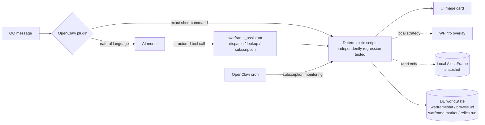

<div align="center">

[简体中文](README.md) | **English**

# 🎴 OpenClaw Warframe Assistant

**A QQ bot for Warframe's global PC service: deterministic commands render polished cards instantly, while AI is limited to routing and commentary—never inventing data**

[](LICENSE)
[](https://github.com/FFangx/openclaw-warframe-assistant/actions/workflows/ci.yml)
[](https://nodejs.org)
[](FAQ.md)
[](https://openclaw.ai)
[](https://www.warframe.com)

[Install](INSTALL.md) · [Configure](CONFIG.md) · [FAQ](FAQ.md) · [Command reference](docs/COMMANDS.md) · [Capability reference](skill/references/capabilities.md) · [Changelog](CHANGELOG.md) · [Asset licenses](ASSET-LICENSES.md) · [Security](SECURITY.md)

</div>

> [!IMPORTANT]
> This project is built for Simplified Chinese-speaking players on Warframe's global PC service. Bot cards, help text, commands, and the detailed documentation linked above are currently Chinese-first. This page explains the project in English; it does not enable an English runtime UI.

---

## What it looks like

**World state is more than a list.** Filter fissures for fast runs, or search the currently active bounty rotation by reward:

| `裂缝 速刷` (fast fissures) | `赏金 阿耶精华` (Aya bounties) |
|:---:|:---:|
|  |  |
| *Normal/Steel Path/Railjack filters, mission tags, and time remaining* | *Current rotation, location, level, and matching probability* |

**Your inventory participates in the decision.** The assistant can answer “What should I open now?” and “How can I obtain enough Ducats while sacrificing the least Platinum?”

| `开遗物 未入库 白金 速刷 单人` | `杜卡德 600` |
|:---:|:---:|
|  |  |
| *Inventory × missing items × market data × live fissures, ranked as a Top 8* | *A low-opportunity-cost plan based on reliable trade medians* |

**Long-term progress fits on one card.** Weekly tasks can be checked against a local snapshot, while Riven cards are recalculated consistently and given conservative market ranges:

| `周常` (weeklies) | `我的紫卡` (my Rivens) |
|:---:|:---:|
|  |  |
| *Archon Hunt, Deep/Temporal Archimedea, Circuit, Nightwave, and the 1999 Calendar* | *Veiled/unveiled status, stat grading, sample quality, and price range* |

Dark cards · official Simplified Chinese terminology · in-game currency icons · 2× rendering · personal data read only from local snapshots · showcase images contain no other players' identities

## What it can do

- **Market prices:** `wm 悟空p` and `wm 赋能充沛 满级` show live warframe.market buy/sell orders, 90-day trade medians, and an in-game whisper template.
- **Relics and acquisition routes:** `遗物 前x1` shows all six rewards and refinement expectations; `遗物 战刃` searches backwards from a reward; `获取 Wukong Prime 系统蓝图` gives a detailed route for one component; and `获取 Caliban p` summarizes all four Warframe components.
- **World state:** `裂缝` lists normal, Steel Path, and Railjack fissures with speed, comfort, endurance, and bonus-reward labels. `裂缝 九重天` keeps only Void Storms. In an authorized private chat, each mission is paired with a compatible relic from the user's inventory. Arbitration, alerts, invasions, Sorties, Steel Path Incursions, bounties, and Baro Ki'Teer are also covered.
- **Subscriptions:** fourteen event categories are monitored at their natural refresh boundaries and deduplicated, including fissures, desirable Arbitrations, alerts, bounties, rotations, Baro, local drops, and weekly tasks.
- **Market wish list:** `愿望 商品 价格` monitors one or more items. One shared WebSocket discovers new sell orders within seconds, while low-frequency REST checks cover disconnect gaps. Users explicitly close a hit with `已购 W3K7`; the assistant never buys anything.
- **Weekly dashboard:** eleven weekly activities, AlecaFrame-backed automatic evidence, Circuit reward tracks, Nightwave season progress, and rank projections on one card.
- **Ducat planning** (requires [AlecaFrame](https://alecaframe.com)): `杜卡德 600` finds a combination with low Platinum opportunity cost using reliable daily/90-day trade medians and volume rather than blindly trusting the lowest listing. Completed-set protection is the default and can be overridden with `保留N` or `保留N套`.
- **Baro route comparison:** compares the opportunity cost of Prime parts plus Credits against the rank-zero player-market price plus the exact trade tax.
- **Personal inventory tools** (requires [AlecaFrame](https://alecaframe.com)): `开遗物` ranks owned relics and pairs each with live fissures. Hard filters can restrict results to Steel Path (`钢铁`) or Void Storms (`九重天`). Other tools cover inventory valuation, drop monitoring, Riven estimates, refinement advice, Baro purchase planning, store purchase reconciliation, and weekly recommendations.
- **Optional in-game decisions with WFInfo:** a product-targeted `开遗物` strategy can be synchronized to the pinned WFInfo OpenClaw companion build. During a relic reward screen, it marks whether to keep a reward for Platinum or convert it to Ducats. `install.ps1 -WithWFInfo` installs this separate Apache-2.0 component with fixed-version and dual SHA-256 verification.
- **Natural-language continuity:** questions such as “悟空p多少钱” (How much is Wukong Prime?), “哪里刷夜灵p” (Where can I farm Revenant Prime?), and “这周还剩啥没做” (What weeklies remain?) are routed by AI, but every number comes from deterministic scripts. A short-lived, redacted entity context lets a follow-up such as “这个甲多少钱” (How much is this Warframe?) perform a fresh lookup.

Cards may suggest up to two next commands based on the result. For example, an acquisition card may suggest checking the full-set market price, while a market card may link back to an acquisition route.

Most deterministic commands render 600–800 px dark cards. If rendering fails or no card template exists, the assistant falls back honestly to Chinese text rather than fabricating a visual result.

Unsupported syntax, genuine no-result cases, and public-source failures such as 403/404/429 responses, timeouts, or schema changes have distinct user-facing errors. Replies state whether a retry or cached/fallback result was used and suggest a command the user can send next. Cached data is never presented as live, and internal URLs, response bodies, stack traces, and account identifiers are never exposed.

## Architecture at a glance



- `skill/`: deterministic runtime scripts, complete script-level regression tests, `SKILL.md` as the AI behavior contract, and visual assets. There are no mandatory npm runtime dependencies; `sharp` is optional.
- `extension/`: the OpenClaw plugin that intercepts exact commands and exposes a structured natural-language tool. Cards produced by tools are delivered directly to QQ by the plugin.
- `config/AGENTS.warframe.md`: the read-only and privacy boundary that the installer maintains inside the user's `AGENTS.md`.

Data comes from DE's official PC world state, api.warframestat.us, the browse.wf community mirror, warframe.market v2 products/orders and v1 closed-trade statistics, relics.run, community fallback datasets on raw.githubusercontent.com, read-only local AlecaFrame snapshots, and cdn.alecaframe.com as a catalog fallback. See the [source contract](skill/references/sources.md) and [NOTICE.md](NOTICE.md) for the exact fallback order and attribution.

## Quick start

### Ask an AI coding assistant to install it (recommended)

Give a terminal-capable AI coding assistant the repository URL and ask it to follow [`INSTALL.md`](INSTALL.md). The Chinese README contains a ready-to-copy, tightly scoped installation prompt. The QQ official-bot application still has to be completed by you.

The safe installation workflow is:

1. Read `README.md`, `INSTALL.md`, `SECURITY.md`, and `config/AGENTS.warframe.md` before changing the machine.
2. Check Windows, Git, Node.js 20+, OpenClaw, Chrome/Edge, and the existing OpenClaw workspace. Do not overwrite local changes or secrets.
3. Use the repository's `install.ps1`; do not manually copy managed files or skip preflight, agent-boundary, or cron checks.
4. Install WFInfo only when the user explicitly requests it, using `-WithWFInfo`.
5. Restart the Gateway, run the runtime doctor and `verify.ps1`, and do not send a real QQ message as part of verification.

### Manual installation

Clone the repository or download its ZIP archive:

```powershell
git clone https://github.com/FFangx/openclaw-warframe-assistant.git
cd openclaw-warframe-assistant
```

Read [INSTALL.md](INSTALL.md) first. Applying for a QQ official bot is the most involved prerequisite and cannot be automated by this project.

```powershell
# From the repository root: synchronize the skill and plugin, and update
# the managed safety block in AGENTS.md idempotently.
powershell.exe -NoProfile -ExecutionPolicy Bypass -File .\install.ps1

# Optionally install the separately licensed WFInfo companion build.
powershell.exe -NoProfile -ExecutionPolicy Bypass -File .\install.ps1 -WithWFInfo

# Reload the installed skill and plugin.
openclaw.cmd gateway restart

# Inspect the installed runtime and capability matrix.
node "$env:USERPROFILE\.openclaw\workspace\skills\warframe-assistant\scripts\doctor.mjs"

# Verify source tests, deployment parity, runtime entry points, the plugin, and Gateway.
powershell.exe -NoProfile -ExecutionPolicy Bypass -File .\verify.ps1
```

The installer runs source tests, synchronizes files from a managed manifest, and verifies every managed file with SHA-256. Obsolete managed files are moved into a recoverable deployment backup. The runtime `.warframe-assistant-build.json` records the version, Git commit, dirty-tree flag, and content hash; `doctor.mjs` displays the build that is actually running.

## Public installation lifecycle

| Operation | Command | Behavior |
|---|---|---|
| Install | `.\install.ps1` | Synchronizes the skill/plugin, updates the managed `AGENTS.md` safety block, and installs the declared daily cron job. |
| Upgrade | `.\install.ps1` | Updates managed files only. Replaced files go to `.openclaw\warframe-assistant-deploy-backups\`; dependencies, state, caches, and personal configuration are preserved. |
| Uninstall preview | `.\uninstall.ps1 -WhatIf` | Reports the planned operations without changing files. |
| Uninstall | `.\uninstall.ps1` | Moves managed assistant files into a recoverable backup and preserves user data. |
| Uninstall with WFInfo | `.\uninstall.ps1 -RemoveWFInfo` | After validating its management marker, moves the WFInfo directory to a timestamped sibling backup instead of deleting it. |

The uninstaller touches only entries recorded in the managed manifests and the marked `AGENTS.md` block. Unknown user files are preserved. Cron removal uses an exact declaration key; subscription and drop-monitor tasks are reported but not deleted. State, caches, deployment backups, and personal files remain by default.

## Support boundaries

- This is a personally maintained hobby project with **no SLA**. Issue and pull-request response times are not guaranteed; see [SUPPORT.md](SUPPORT.md) and [CONTRIBUTING.md](CONTRIBUTING.md).
- Only **Windows** and Warframe's global PC service are supported. AlecaFrame is Windows-only, and the mainland-China service has no compatible public API. Linux and macOS are untested.
- The runtime requires Node.js 20+ and Chrome or Edge. CI covers Node.js 20 and 24. `sharp` is an optional rendering optimization.
- The safety boundary is non-negotiable: no market writes, no in-game automation, and personal data only in the owner's authorized private chat. See [SECURITY.md](SECURITY.md) for private vulnerability reporting.

## Privacy summary

- **Data that leaves the machine:** only the search terms and public-state requests required for a query are sent to public data sources: DE's official endpoint, api.warframestat.us, warframe.market, browse.wf, relics.run, selected community datasets on raw.githubusercontent.com, and cdn.alecaframe.com. Requests never contain a QQ OpenID, Warframe account identifier, raw AlecaFrame snapshot, or credential.
- **Data that never leaves the machine:** the AlecaFrame snapshot is parsed locally and read-only. Subscription ledgers, weekly state, cards, and caches remain inside the local OpenClaw workspace. The project does not read a warframe.market login token and does not upload snapshots.
- The managed `AGENTS.md` block declares only read-only and privacy constraints; it contains no identity information.

## Release process

The root [`VERSION`](VERSION) file is the single version source. GitHub Actions runs `verify.ps1 -SourceOnly` on Node.js 20 and 24 for every push, pull request, and tag. It also checks that `skill/package-lock.json` is reproducible. Third-party actions are pinned to full commit SHAs, checkout credential persistence is disabled, and permissions remain read-only.

Formal releases use `release.ps1`, which validates a clean and synchronized `main` branch, source verification, version metadata, and tag availability before creating a `vX.Y.Z` tag:

```powershell
powershell.exe -NoProfile -ExecutionPolicy Bypass -File .\release.ps1 -DryRun
powershell.exe -NoProfile -ExecutionPolicy Bypass -File .\release.ps1 -Push
```

## Three things to know before installing

1. **The safety boundary must be part of the startup context.** The project prohibits market writes and game automation. The installer maintains a controlled block in `AGENTS.md`, and `SKILL.md` carries the corresponding runtime rules. A high reasoning setting is still recommended for the primary model.
2. **Windows comes first.** AlecaFrame is Windows-only. Without it, all personal-data features are unavailable, while public queries continue to work through online catalog fallbacks. Linux and macOS are untested.
3. **Read-only means read-only.** The assistant does not inspect game memory, inject code, or control the game process. It reads AlecaFrame's files and public APIs only, and never touches a warframe.market login token. Use is at your own risk and is not affiliated with Digital Extremes.

## Documentation

The detailed operational documentation remains Chinese-first because the product's commands and output are Chinese-first.

| Document | Purpose |
|---|---|
| [INSTALL.md](INSTALL.md) | Installation prerequisites and lifecycle, including uninstall behavior |
| [CONFIG.md](CONFIG.md) | One required setting and optional environment variables |
| [FAQ.md](FAQ.md) | Frequently asked questions |
| [docs/COMMANDS.md](docs/COMMANDS.md) | Generated canonical command reference |
| [skill/references/capabilities.md](skill/references/capabilities.md) | Complete behavior and degradation matrix |
| [NOTICE.md](NOTICE.md) | Licensing scope, data exclusions, and source attribution |
| [ASSET-LICENSES.md](ASSET-LICENSES.md) | Per-asset sources and license scope |
| [SECURITY.md](SECURITY.md) | Private vulnerability reporting |
| [SUPPORT.md](SUPPORT.md) | Support boundary and no-SLA policy |
| [CONTRIBUTING.md](CONTRIBUTING.md) | Contribution and test requirements |
| [config/AGENTS.warframe.md](config/AGENTS.warframe.md) | Global read-only and privacy boundary managed by the installer |

## License

The project code is licensed under the MIT License; see [LICENSE](LICENSE). Warframe game assets remain the property of Digital Extremes. Community-data attribution is documented in [NOTICE.md](NOTICE.md), individual bundled assets in [ASSET-LICENSES.md](ASSET-LICENSES.md), and Apache-2.0 attribution for genesis-assets-derived icons in [LICENSES/](LICENSES/genesis-assets.md).
