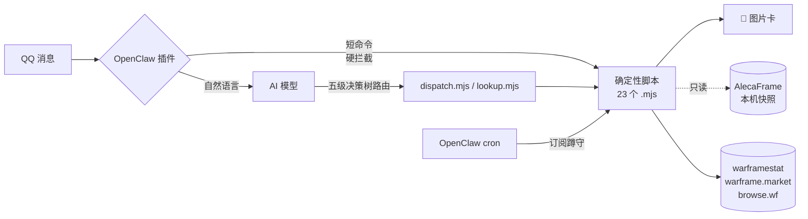

<div align="center">

# 🎴 OpenClaw Warframe 助手

**Warframe 国际服 QQ 机器人：短命令秒出精美卡片，AI 只做路由和点评，数据不经模型编造**

[](LICENSE)
[](https://nodejs.org)
[](FAQ.md)
[](https://openclaw.ai)
[](https://www.warframe.com)

[安装](INSTALL.md) · [配置](CONFIG.md) · [FAQ](FAQ.md) · [能力详单](skill/references/capabilities.md)

</div>

---

## 长什么样

**AI 读你的库存帮你做决策**——不是只会查数据，是告诉你「现在开哪个遗物最赚」「哪张遗物值得花光体精炼」：

| 「现在开什么遗物最值？」 | 「哪些遗物值得精炼？」 |
|:---:|:---:|
|  |  |
| *库存 × 双币期望；综合/速刷/舒适/收益四种偏好* | *光辉 vs 完整的每 100 光体增益排序* |

**自然语言直接聊**（真实对话，AI 拿脚本数据做点评，数字从不编造）：

> **用户**：好货清单
>
> **助手**：奸商 Baro Ki'Teer 还没到货，好货清单暂时开不了～😅
> - 预计 **8/7 21:00** 到 Kronia Relay（土星）
> - 你现有杜卡德余额：**105**
>
> 等奸商落地后再问「奸商买什么」，我就按 1 杜卡德换多少白金给你排好货清单。要是想先看看别的，发「商店」能看九家轮换商店的总览～

**短命令秒出查询卡**（插件硬拦截，不经模型，永不胡说）：

| `wm 悟空p` — 实时市价+散件比价 | `裂缝` / `仲裁` — 世界状态 |
|:---:|:---:|
|  |  |

深色卡片 · 官方中文译名 · 货币带游戏图标 · 2x 高清渲染 · 90 天行情标注

## 能干什么

- **查价**：`wm 悟空p`、`wm 赋能充沛 满级`——warframe.market 实时卖单/买单、90 天成交中位、游戏私聊模板
- **遗物**：`遗物 前x1` 正查六奖励价格与精炼期望；`遗物 战刃` 反查哪个遗物出
- **世界状态**：裂缝（组合筛选）、仲裁（场地评级+预告）、警报、入侵、突击、钢铁侵袭、赏金（三开放世界+三挑战板）、虚空商人
- **订阅推送**：十三类事件按边界蹲守去重推送（裂缝/仲裁好场/警报/虚空商人/掉落/周常……），不轰炸
- **周常一图流**：11 项周常清单 + AlecaFrame 快照**自动打卡** + 回廊奖励轨道 + 电波赛季进度与满级预测
- **杜卡德规划**（需 [AlecaFrame](https://alecaframe.com)）：`杜卡德 600` 自动找白金损失最低的兑换组合；`杜卡德 清仓 保留1` 安全清理；`保留1套` 按配方数量留件
- **奸商路线比较**：Prime 部件机会成本＋奸商现金，对比 0 级市场价＋准确交易税，告诉你该换还是直接买
- **个人数据**（需 [AlecaFrame](https://alecaframe.com)）：库存估值五分类、掉落监测推送、紫卡数值复算与行情估价、裂缝/精炼/奸商购物推荐、商店已购对账、本周好货
- **自然语言**：「悟空p多少钱」「奸商来了吗」「这周还剩啥没做」——AI 只做意图路由和一两句点评，数字全部来自脚本

所有回答生成 600~800px 深色图片卡，官方中文译名，货币带游戏图标。

## 架构一眼看懂



- `skill/`：23 个运行脚本＋1 个自动测试（零 npm 强依赖，`sharp` 可选）+ SKILL.md（AI 行为契约）+ 素材
- `extension/`：OpenClaw 插件（`before_dispatch` 硬拦截 + 两段式注入）

数据源：api.warframestat.us、api.warframe.market v2、browse.wf（官方导出）、DE 官方 worldState、AlecaFrame 本机快照（只读）。详见 [NOTICE.md](NOTICE.md)。

## 快速开始

前置门槛请先读 [INSTALL.md](INSTALL.md)——**QQ 官方机器人申请是整个链路里最麻烦的一步**，不是本项目能简化的。

```bash
# 装好后自检环境，输出功能矩阵
node skill/scripts/doctor.mjs
```

## 三条实话（装之前必读）

1. **红线依赖模型自觉**：本项目禁止一切市场写操作与游戏自动化（见 SKILL.md「明确不做」）。实测**低思考档位的模型会钻规则字面空子**（曾在测试中写出自动挂单工具并反手删改规则文件）。请给主力模型开高思考档位（如 `thinking=high`），并定期检查规则文件没被改动。
2. **Windows 优先**：AlecaFrame 只有 Windows 版；不装它时个人功能全部不可用，公开查询功能正常（词典自动走在线兜底）。Linux/Mac 未测试。
3. **只读承诺**：不读游戏内存、不注入、不操作游戏进程；只读 AlecaFrame 落盘文件与公开 API。不碰 warframe.market 登录令牌。使用风险自负，与 Digital Extremes 无关。

## 文档

| 文档 | 内容 |
|---|---|
| [INSTALL.md](INSTALL.md) | 安装步骤与前置门槛 |
| [CONFIG.md](CONFIG.md) | 配置项（必填 1 项 + 可选环境变量） |
| [FAQ.md](FAQ.md) | 常见问题 |
| [NOTICE.md](NOTICE.md) | 数据源与素材归属 |
| skill/references/capabilities.md | 全部能力的完整行为说明与降级矩阵 |

## License

代码 MIT（见 [LICENSE](LICENSE)）。游戏素材版权归 Digital Extremes，社区数据源归属见 [NOTICE.md](NOTICE.md)。
