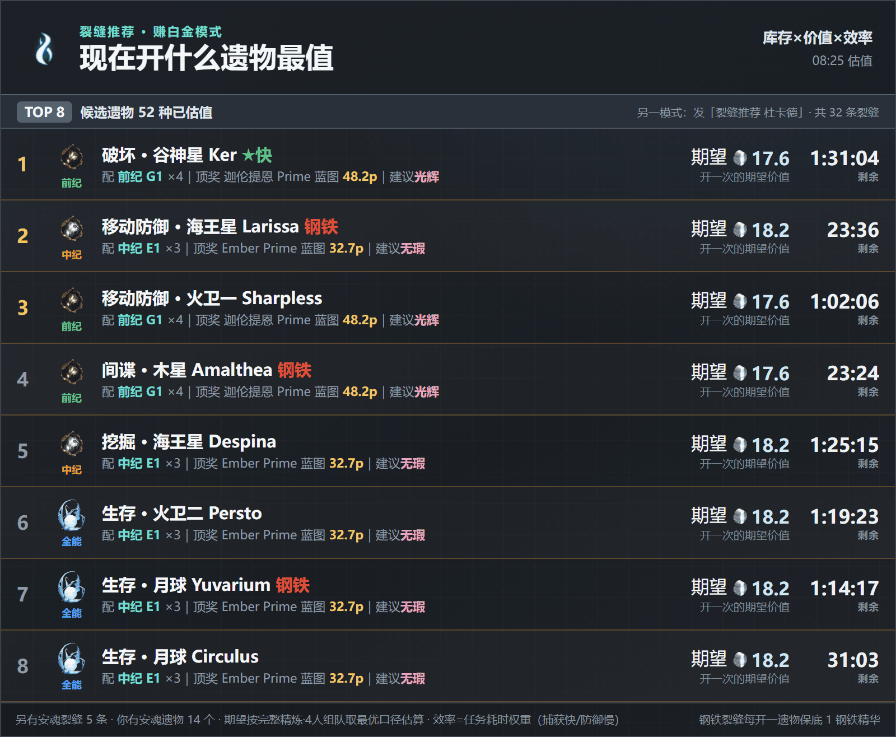
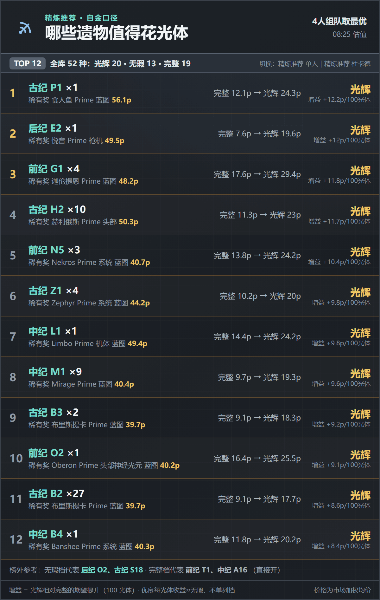
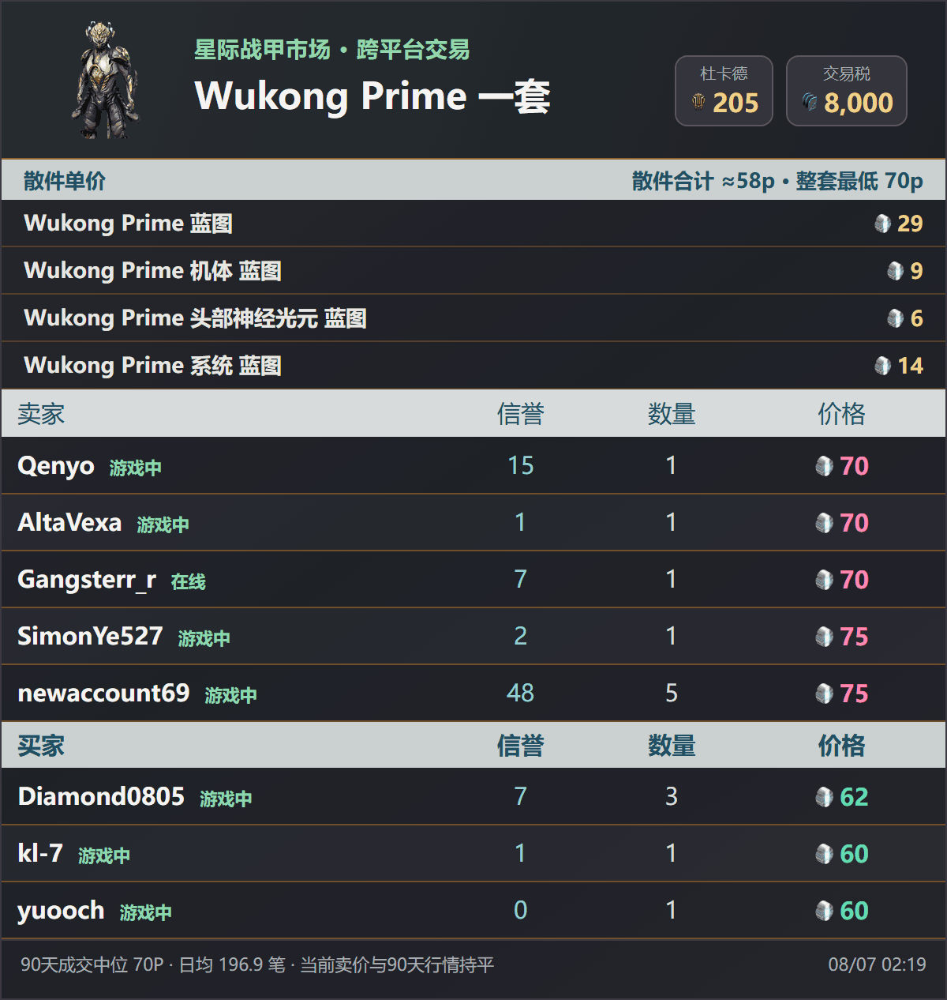
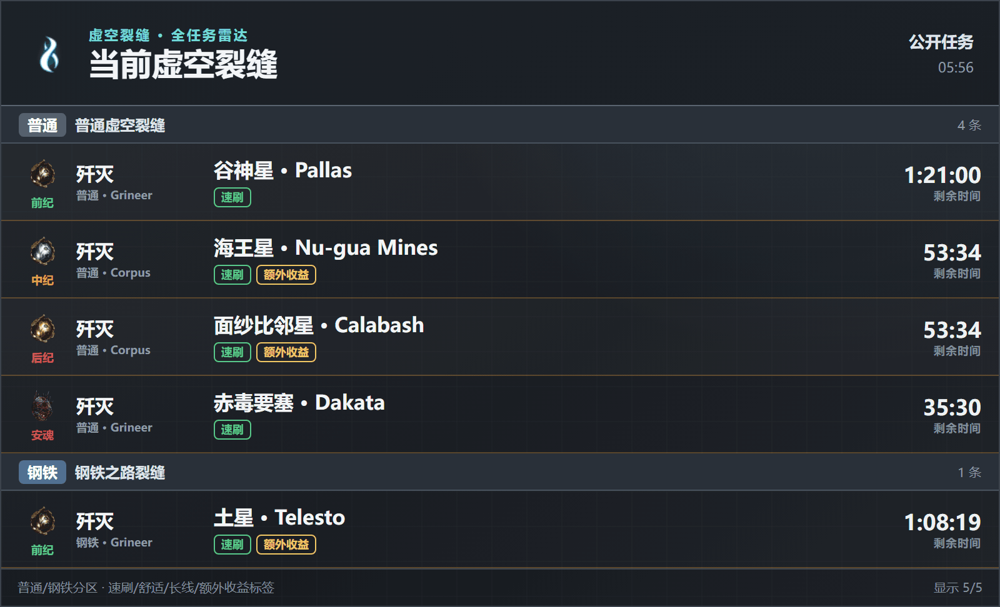
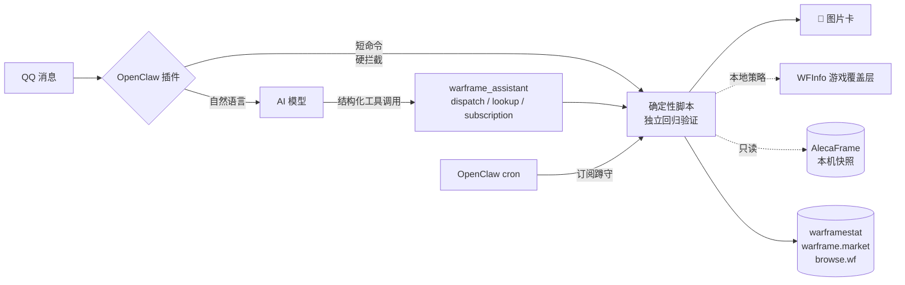

<div align="center">

# 🎴 OpenClaw Warframe 助手

**Warframe 国际服 QQ 机器人：短命令秒出精美卡片，AI 只做路由和点评，数据不经模型编造**

[](LICENSE)
[](https://github.com/FFangx/openclaw-warframe-assistant/actions/workflows/ci.yml)
[](https://nodejs.org)
[](FAQ.md)
[](https://openclaw.ai)
[](https://www.warframe.com)

[安装](INSTALL.md) · [配置](CONFIG.md) · [FAQ](FAQ.md) · [能力详单](skill/references/capabilities.md) · [更新日志](CHANGELOG.md)

</div>

---

## 长什么样

**AI 读你的库存帮你做决策**——不是只会查数据，是告诉你「现在开哪个遗物最赚」「哪张遗物值得花光体精炼」：

| 「现在开什么遗物最值？」 | 「哪些遗物值得精炼？」 |
|:---:|:---:|
|  |  |
| *遗物先行：库存 × 双币期望；每枚最多两条路线* | *光辉 vs 完整的每 100 光体增益排序* |

**自然语言直接聊**（真实对话，AI 拿脚本数据做点评，数字从不编造）：

> **用户**：好货清单
>
> **助手**：奸商 Baro Ki'Teer 还没到货，好货清单暂时开不了～😅
> - 预计 **8/7 21:00** 到 Kronia Relay（土星）
> - 你现有杜卡德余额：**105**
>
> 等奸商落地后再问「奸商买什么」，我就按 1 杜卡德换多少白金给你排好货清单。要是想先看看别的，发「商店」能看九家轮换商店的总览～

**短命令秒出查询卡**（插件硬拦截，不经模型，永不胡说）：

| `wm 悟空p` — 实时市价+散件比价 | `裂缝 速刷` / `仲裁` — 世界状态 |
|:---:|:---:|
|  |  |

深色卡片 · 官方中文译名 · 货币带游戏图标 · 2x 高清渲染 · 90 天行情标注

## 能干什么

- **查价**：`wm 悟空p`、`wm 赋能充沛 满级`——warframe.market 实时卖单/买单、90 天成交中位、游戏私聊模板
- **遗物与获取路线**：`遗物 前x1` 正查六奖励价格与精炼期望；`遗物 战刃` 反查哪个遗物出；`哪里刷 Wukong Prime 系统蓝图`给单部件详细路线，`哪里刷 Caliban p`给整套四部件总览
- **世界状态**：`裂缝`完整列出普通/钢铁任务并标注速刷、舒适、长线、额外收益；主人私聊时逐任务推荐兼容库存遗物；另有仲裁、警报、入侵、突击、钢铁侵袭、赏金、虚空商人
- **订阅推送**：十三类事件按边界蹲守去重推送（裂缝/仲裁好场/警报/虚空商人/掉落/周常……），不轰炸
- **周常一图流**：11 项周常清单 + AlecaFrame 快照**自动打卡** + 回廊奖励轨道 + 电波赛季进度与满级预测
- **杜卡德规划**（需 [AlecaFrame](https://alecaframe.com)）：`杜卡德 600` 按可靠的今日/90 日成交中位寻找白金损失最低的组合，并标日均量；不以最低卖单估值。默认按成品拥有状态智能保留，`保留N/保留N套` 可显式覆盖
- **奸商路线比较**：Prime 部件机会成本＋奸商现金，对比 0 级市场价＋准确交易税，告诉你该换还是直接买
- **个人数据**（需 [AlecaFrame](https://alecaframe.com)）：`开遗物`按遗物价值推 TOP8，加`钢铁`只匹配钢铁裂缝；`开遗物 商品名`先按奸商商品保本线筛选，再列“立即可开＋最多三种建议获取”，不假定野队四人开同一遗物。另有库存估值、掉落监测、紫卡估价、精炼/奸商购物推荐、商店已购对账、本周好货；非 `wm` 估值统一优先采用可靠今日成交中位，样本不足回退 90 日中位
- **WFInfo 游戏内决策（可选）**：指定商品的`开遗物`把目标、保本线和同口径奖励估值同步到修改版 WFInfo；开奖后按实际四项奖励标出“保留白金 / 兑换杜卡德”，无需切回 QQ。旧命令`开遗物 杜卡德 商品名`继续兼容
- **自然语言**：「悟空p多少钱」「奸商来了吗」「这周还剩啥没做」——AI 只做意图路由和一两句点评，数字全部来自脚本

所有回答生成 600~800px 深色图片卡，官方中文译名，货币带游戏图标。

## 架构一眼看懂



- `skill/`：确定性运行脚本＋完整脚本回归（零 npm 强依赖，`sharp` 可选）+ SKILL.md（AI 行为契约）+ 素材
- `extension/`：OpenClaw 插件（严格裸命令硬拦截 + 自然语言结构化工具；工具生成的卡片由插件直接投递 QQ）
- `config/AGENTS.warframe.md`：安装器追加到用户 `AGENTS.md` 的只读与隐私安全边界

数据源：api.warframestat.us、api.warframe.market v2、browse.wf（官方导出）、DE 官方 worldState、AlecaFrame 本机快照（只读）。详见 [NOTICE.md](NOTICE.md)。

## 快速开始

前置门槛请先读 [INSTALL.md](INSTALL.md)——**QQ 官方机器人申请是整个链路里最麻烦的一步**，不是本项目能简化的。

```powershell
# 在仓库根目录执行：同步 skill、插件，并幂等更新 AGENTS.md 安全片段
# ExecutionPolicy Bypass 只作用于本次进程，不修改系统全局策略
powershell.exe -NoProfile -ExecutionPolicy Bypass -File .\install.ps1

# 装好后自检环境，输出功能矩阵
node "$env:USERPROFILE\.openclaw\workspace\skills\warframe-assistant\scripts\doctor.mjs"

# 一次验证源码测试、部署一致性、运行时入口、插件和 Gateway
powershell.exe -NoProfile -ExecutionPolicy Bypass -File .\verify.ps1
```

安装器会先跑源码测试，再用受管文件清单同步 Skill/插件并逐文件校验 SHA-256；源码已删除的旧受管文件会移入工作区内的可恢复部署备份。运行时的 `.warframe-assistant-build.json` 记录版本、Git commit、脏工作树标志和内容哈希，`doctor.mjs` 会直接显示当前运行构建。

## 发布

版本唯一来源是仓库根目录的 `VERSION`（当前 `1.0.0`）。GitHub Actions 在每次 push/PR/tag 时运行 `verify.ps1 -SourceOnly`（源码测试 + 安装器生命周期）。正式发布走 `release.ps1`：它校验干净工作树、`main` 与远端一致、源码验证通过、tag 不存在，然后把 `CHANGELOG.md` 的 `[Unreleased]` 章节落成版本章节并打 `vX.Y.Z` 标签：

```powershell
powershell.exe -NoProfile -ExecutionPolicy Bypass -File .\release.ps1 -Version 1.1.0   # 预览用 -DryRun，推送加 -Push
```

## 三条实话（装之前必读）

1. **安全边界要进启动上下文**：本项目禁止一切市场写操作与游戏自动化。安装器会把仓库维护的受控片段追加到 `AGENTS.md`，并在升级时原地更新、不重复追加；SKILL.md 同时保留同一方向的运行规则。仍建议给主力模型开高思考档位（如 `thinking=high`）。
2. **Windows 优先**：AlecaFrame 只有 Windows 版；不装它时个人功能全部不可用，公开查询功能正常（词典自动走在线兜底）。Linux/Mac 未测试。
3. **只读承诺**：不读游戏内存、不注入、不操作游戏进程；只读 AlecaFrame 落盘文件与公开 API。不碰 warframe.market 登录令牌。使用风险自负，与 Digital Extremes 无关。

## 文档

| 文档 | 内容 |
|---|---|
| [INSTALL.md](INSTALL.md) | 安装步骤与前置门槛 |
| [CONFIG.md](CONFIG.md) | 配置项（必填 1 项 + 可选环境变量） |
| [FAQ.md](FAQ.md) | 常见问题 |
| [NOTICE.md](NOTICE.md) | 数据源与素材归属 |
| [config/AGENTS.warframe.md](config/AGENTS.warframe.md) | 安装器维护的全局只读与隐私边界 |
| skill/references/capabilities.md | 全部能力的完整行为说明与降级矩阵 |

## License

代码 MIT（见 [LICENSE](LICENSE)）。游戏素材版权归 Digital Extremes，社区数据源归属见 [NOTICE.md](NOTICE.md)。
